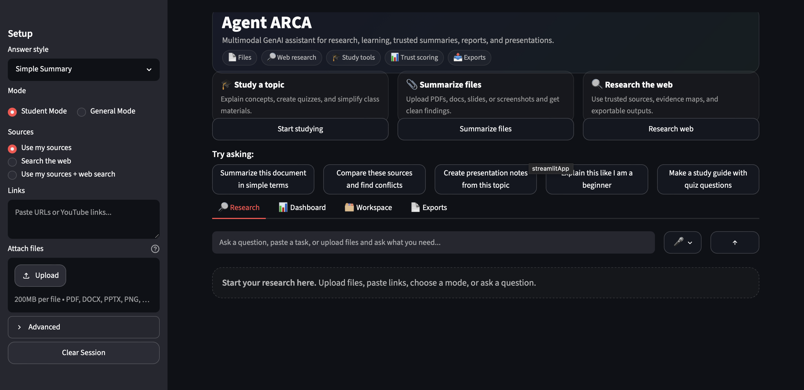
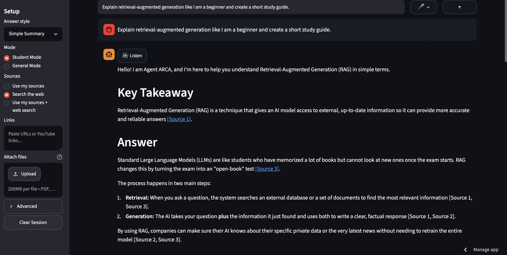
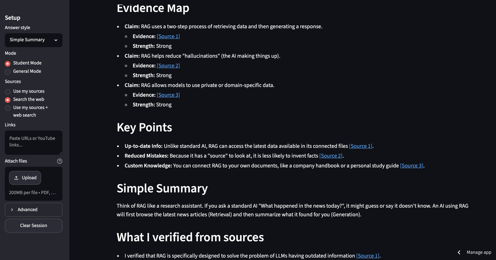
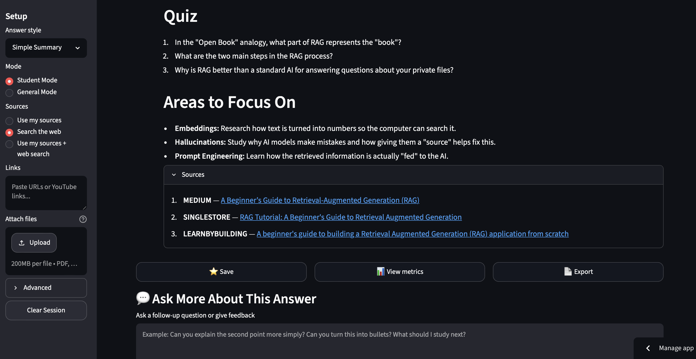
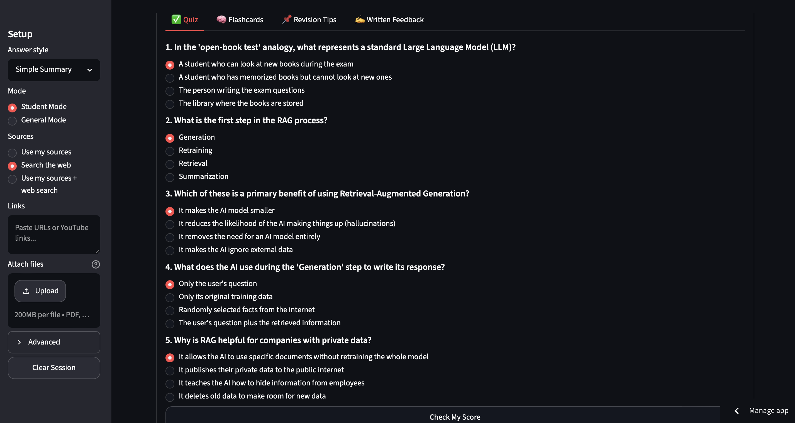
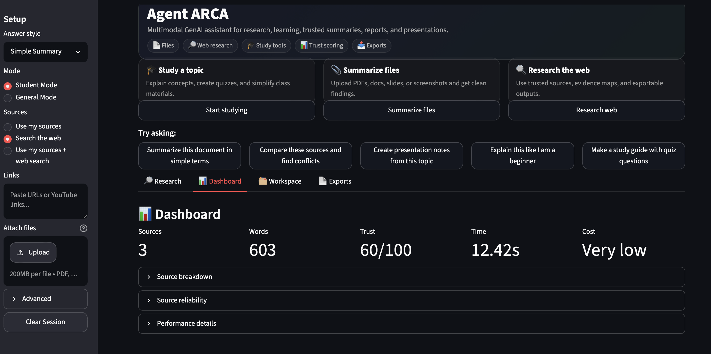
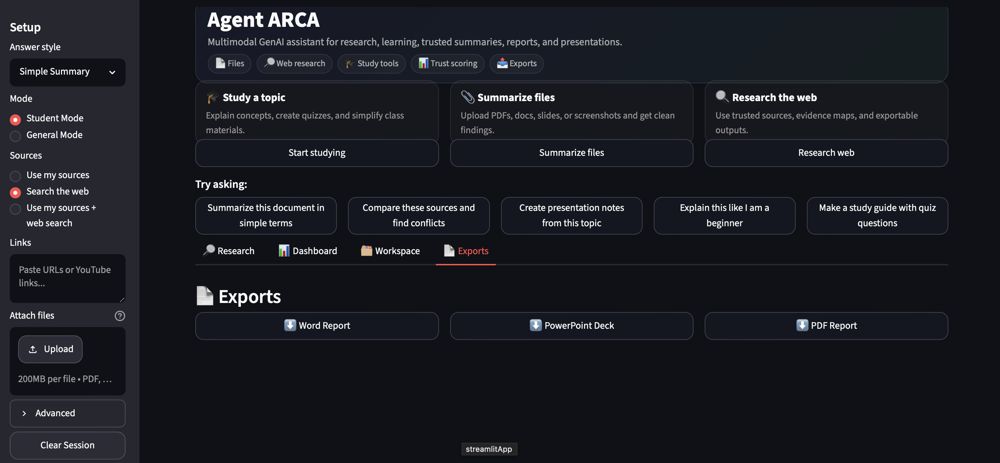

# Agent ARCA — Multimodal GenAI Research & Learning Assistant

Agent ARCA is a multimodal AI research and learning assistant that helps users turn files, links, web results, videos, screenshots, and images into trusted summaries, study guides, decision briefs, reports, and presentation decks.

It is designed for students, researchers, and professionals who need to understand information quickly, compare sources, check credibility, and export polished outputs.

---

## Overview

Research and learning often require switching between many tools: PDFs, websites, lecture slides, screenshots, YouTube videos, notes, search engines, and document editors. Agent ARCA brings these workflows into one AI-powered interface.

The app can process uploaded files, pasted links, web search results, and visual content, then generate source-backed answers with trust scoring, follow-up questions, learning practice, and export-ready reports.

---

## Key Features

### Multimodal Input

Agent ARCA supports multiple content types:

* PDF documents
* Word documents
* PowerPoint presentations
* Screenshots and images
* URLs and web articles
* YouTube transcripts
* Web search results

### AI Research Workflows

* Source-backed answers
* Topic summaries
* Detailed research responses
* Decision briefs
* Presentation notes
* Source comparison
* Evidence maps
* Follow-up Q&A

### Student Learning Mode

Student Mode helps users understand topics more clearly through:

* Beginner-friendly explanations
* Study guides
* Multiple-choice quizzes
* Flashcards
* Revision tips
* Written answer feedback
* Audio playback for answers

### Professional Research Mode

General Mode supports professional use cases such as:

* Research summaries
* Business decision briefs
* Source comparison
* Risk and benefit analysis
* Presentation-ready notes
* Export-ready documentation

### Source Reliability and Trust Scoring

Agent ARCA adds transparency to AI-generated answers by ranking and labeling sources.

It includes:

* Source reliability scoring
* Trust dashboard
* Citation-style source markers
* Evidence mapping
* Source breakdown by type
* Reliability labels and reasoning

### Export Options

Generated research can be exported as:

* Word report
* PDF report
* PowerPoint deck
* Saved markdown research collection

---

## Screenshots

### Landing Page



### Research Response



### Research Sources and Evidence



### Research Continuation and Source Details



### Learning Practice



### Dashboard



### Exports



---

## Tech Stack

### Core

* Python
* Streamlit
* Google Gemini API
* Tavily Search API

### Document and Media Processing

* PyMuPDF
* python-docx
* python-pptx
* ReportLab
* BeautifulSoup
* requests
* youtube-transcript-api
* yt-dlp
* webvtt-py
* gTTS

### AI and Retrieval

* Gemini-based generation
* Multimodal content processing
* Prompt orchestration
* Source ranking
* Cached retrieval
* Trust scoring

### Development Tools

* Git
* GitHub
* Streamlit Cloud
* Python virtual environment
* Environment secrets

---

## Architecture

```text
User Input
   |
   |-- Files: PDF, DOCX, PPTX, Images
   |-- Links: URLs, YouTube
   |-- Web Search
   |
   v
Source Processing Layer
   |
   |-- Document parsing
   |-- Web extraction
   |-- YouTube transcript extraction
   |-- Image understanding
   |-- Search retrieval
   |
   v
Source Ranking and Trust Layer
   |
   |-- Source reliability scoring
   |-- Trusted domain detection
   |-- Evidence organization
   |
   v
LLM Orchestration Layer
   |
   |-- Prompt building
   |-- Student Mode
   |-- General Mode
   |-- Output style control
   |-- Follow-up Q&A
   |
   v
User Output
   |
   |-- Answer
   |-- Sources
   |-- Trust dashboard
   |-- Quiz and flashcards
   |-- Word/PDF/PPT exports
```

---

## How It Works

1. The user asks a question, uploads files, or pastes links.
2. Agent ARCA extracts text and context from the provided sources.
3. If enabled, the app searches the web using Tavily.
4. Sources are ranked and scored for reliability.
5. Gemini generates a source-aware response based on the selected mode.
6. The user can ask follow-up questions, generate learning practice, save findings, or export the result.

---

## Project Structure

```text
agent-arca-ai/
│
├── app.py
├── pipeline.py
├── requirements.txt
├── README.md
├── .gitignore
│
├── screenshots/
│   ├── landing.png
│   ├── research-response.png
│   ├── research-sources-1.png
│   ├── research-sources-2.png
│   ├── learning-practice.png
│   ├── dashboard.png
│   └── exports.png
│
└── .streamlit/
    └── secrets.toml
```

---

## Local Setup

### 1. Clone the repository

```bash
git clone https://github.com/apoorvam-10/agent-arca-ai.git
cd agent-arca-ai
```

### 2. Create a virtual environment

```bash
python3 -m venv arca
source arca/bin/activate
```

### 3. Install dependencies

```bash
pip install -r requirements.txt
```

### 4. Add API keys

Create a `.streamlit` folder and a `secrets.toml` file:

```bash
mkdir -p .streamlit
nano .streamlit/secrets.toml
```

Add your keys:

```toml
GEMINI_API_KEY = "your_gemini_api_key"
TAVILY_API_KEY = "your_tavily_api_key"
```

### 5. Run the app

```bash
streamlit run app.py
```

---

## Environment Variables

Agent ARCA uses the following secrets:

```toml
GEMINI_API_KEY = "your_gemini_api_key"
TAVILY_API_KEY = "your_tavily_api_key"
```

Do not commit `.streamlit/secrets.toml` to GitHub.

---

## Example Use Cases

### Student Learning

```text
Explain retrieval-augmented generation like I am a beginner and create a short study guide.
```

### Research Summary

```text
Summarize how AI agents improve enterprise knowledge management in 5 concise bullets with risks and use cases.
```

### File Summarization

```text
Summarize this document in simple terms and list the key takeaways.
```

### Source Comparison

```text
Compare these sources and identify agreements, conflicts, and missing information.
```

### Presentation Notes

```text
Create presentation notes from this topic with slide-ready bullet points.
```

---

## Current Version

Agent ARCA v1 is complete as a portfolio-ready prototype.

Current version includes:

* Multimodal file and web ingestion
* Source-backed AI responses
* Student and general research modes
* Output style selection
* Source reliability scoring
* Trust dashboard
* Follow-up Q&A
* Quiz and flashcard generation
* Audio playback
* Visual snapshot support
* Saved research workspace
* Word, PDF, and PowerPoint exports

---

## Impact

Agent ARCA demonstrates how multimodal GenAI can support research, learning, and decision-making by combining document processing, web retrieval, source-grounded generation, trust scoring, and export-ready outputs in one workflow.

Key outcomes:

* Reduced manual research effort by converting long-form sources into structured summaries and study outputs.
* Improved transparency with source markers, evidence maps, and trust scoring.
* Supported multiple workflows including studying, professional research, presentations, and report generation.
* Improved usability with quick-start actions, unified uploads, follow-up Q&A, audio playback, and interactive learning practice.
* Created export-ready deliverables across Word, PDF, and PowerPoint formats.

---

## What I Learned

Building Agent ARCA helped strengthen practical experience in:

* Multimodal GenAI application design
* LLM workflow orchestration
* Prompt engineering
* Retrieval-augmented generation concepts
* Document processing
* Source ranking and trust scoring
* Streamlit app development
* API integration
* Export generation
* Debugging cloud deployment issues
* Building user-focused AI product workflows

---

## Future Roadmap

Planned improvements for Agent ARCA v2:

* Next.js frontend
* FastAPI backend
* Streaming AI responses
* Persistent user sessions
* User authentication
* Cloud file storage
* PostgreSQL database integration
* Background processing for large files
* More advanced citation tracing
* Multi-agent workflow orchestration
* Deployment with production-ready infrastructure

---

## Repository

GitHub Repository: https://github.com/apoorvam-10/agent-arca-ai

---

## Author

Built by Apoorva Makena.

GitHub: https://github.com/apoorvam-10
